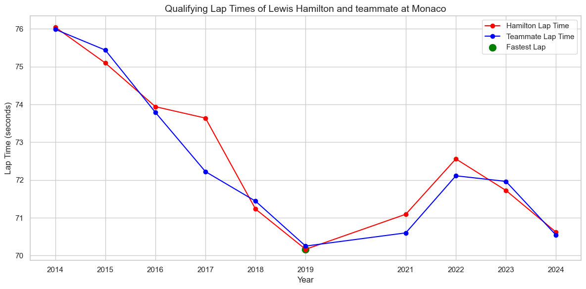

<!-- PROJECT LOGO -->
 

  
  <h3 align="center">Formula 1 Time-Series Lap time Predictor</h3>

<!-- TABLE OF CONTENTS -->

  
Table of Contents

  <ol>
    <li>
      <a href="#about">About</a>
    </li>
    <li>
      <a href="#getting-started">Getting Started</a>
      <ul>
        <li><a href="#datasets">Datasets</a></li>
        <li><a href="#data-preprocessing">Data Preprocessing</a></li>
      </ul>
    </li>
    <li>
      <a href="#model-architecture">Model Architecture</a>
      <ul>
        <li><a href="#input-preprocessing">Input Presprocessing</a></li>
        <li><a href="#neural-network">Neural Network</a></li>
      </ul>
    </li>
    </li>
    <li>  
      <a href="#training-and-prediction">Training and Prediction</a>
      <ul>
        <li><a href="#training-strategy">Training Strategy</a></li>
        <li><a href="#prediction-strategy">Prediction Strategy</a></li>
      </ul>
    </li>
    <li>
      <a href="#results">Results</a>
      <ul>
        <li><a href="#for-seen-data">For Seen Data</a></li>
        <li><a href="#for-unseen-data">For Unseen Data</a></li>
        <li><a href="#abbreviations-and-significance">Abbreviations and Significance</a></li>
      </ul>
    </li>
    <li><a href="#conclusion">Conclusion</a></li>
    <li><a href="#acknowledgements">Acknowledgements</a></li>
  </ol>

<!-- ABOUT THE PROJECT -->
## About

We aim to predict qualifying lap times in Formula 1 using a driver–circuit specific deep learning model. By leveraging historical F1 race data and modeling each driver’s performance at each circuit, we developed a specialized forecasting system that achieves high accuracy with an average prediction deviation of just **0.20% for seen data** and **1.09% for unseen data**.

[Full Project](https://github.com/SusannaJoseph49/F1_Prediction)

## Getting Started
Formula 1, despite being a proprietary and commercialized sport, has a surprisingly rich and open dataset ecosystem available to developers, analysts, and fans. Thanks to community-driven efforts and official data initiatives, you can access decades of detailed historical data on drivers, circuits, lap times, pit stops, qualifying results, and more.

### Datasets

The historical Formula 1 data was pulled from the [open source dataset avaliable on kaggle](https://www.kaggle.com/datasets/rohanrao/formula-1-world-championship-1950-2020).

The 2025 data for the ongoing season was taken from the official [F1 website](https://www.formula1.com/) for testing purposes. [Australia](https://www.formula1.com/en/results/2025/races/1254/australia/qualifying), [China](https://www.formula1.com/en/results/2025/races/1255/china/qualifying), [Japan](https://www.formula1.com/en/results/2025/races/1256/japan/qualifying), [Saudi Arabia](https://www.formula1.com/en/results/2025/races/1258/saudi-arabia/qualifying), [Miami](https://www.formula1.com/en/results/2025/races/1259/miami/qualifying), [Emilia-Romagna](https://www.formula1.com/en/results/2025/races/1260/emilia-romagna/qualifying) and [Monaco](https://www.formula1.com/en/results/2025/races/1261/monaco/qualifying) were taken into consideration. This [dataset](Data/2025_data/2025_qualifying_data.csv) can be expanded as the season progresses. 

### Data Preprocessing

Each Formula 1 circuit has unique characteristics (e.g. corners, elevation, surface, length), and drivers have track-specific strengths. By isolating data to one driver + circuit combination the model learns just one pattern: how that specific driver improves or regresses on that track over time. 
Another factor which influences the performances of various driver are the team they are with. The livery highly dictates the performance. So we include the team and temmate information also with each driver - circuit combination. 

A total of **[621 driver - circuit combinations](Data/driver_circuit_data)** were identified with more than 3 entries. 

## Model Architecture
We are to build a neural network model that predicts the lap times for any driver for any circuit given three core input features.
1. **Year**: Captures car evolution, regulation changes, and performance over time.
2. **Teammate**: Represents how competitive a teammate was under the same car/environment.
3. **Constructor**: Encodes which F1 team (Mercedes, Ferrari, etc.) built the car.

### Input Preprocessing
Neural networks perform best when input features are on a similar scale, typically between 0 and 1. Here's how we handled each:
1. `year` → `MinMaxScaler (0 to 1)`
2. `teammate_time` → `MinMaxScaler (0 to 1)`
3. `constructorId` → `MinMaxScaler (0 to 1)`
4. `lap_time_seconds` (Target) → `MinMaxScaler (-1 to 1)`

### Neural Network
The architecture is a 3-layer feedforward network with Parametric ReLU activations and a `tanh` output for scaled regression. We have choosen a **lightweight** architecture because our dataset is small (at max 6-10 data points in every combination csv). PReLU is more expressive for smallm datasets compared to ReLU. 

| Layer No. | Layer Type   | Input Size | Output Size | Activation | Description                                      |
|-----------|--------------|------------|-------------|------------|--------------------------------------------------|
| 1         | Linear       | 3          | 8           | PReLU      | First hidden layer; maps 3 input features to 8   |
| 2         | Linear       | 8          | 6           | PReLU      | Second hidden layer for deeper representation    |
| 3         | Linear       | 6          | 1           | Tanh       | Output layer to predict lap time in scaled form  |

The **Tanh at output** matches the normalized target range `[-1, 1]`, enabling smoother regression.

## Training and Prediction

### Training Strategy
A separate model is trained for every driver circuit combination. `SmoothL1Loss` loss function is applied to minimize loss and `Adam optimizer` is applied to update weights with a learning rate `lr = 0.01`. 

Each model is trained for 500 epochs and we are doing **full-batch testing** as our dataset is small.

Loss is computed and backpropogated and weights are updated using the optimizer. 
The **output** is a trained model and fitted scalars for the inputs (`year_scaler`, `lap_time_scaler`, `teammate_scaler`, `constructor_scaler`). 

### Prediction Strategy
After training, the model is used to predict the **lap time for a specific year** (e.g., `2022` or `2025`) for that driver-circuit pair. Baseds on if the year is in the training kaggle dataset or not we follow different code setups. 

The inputs are normalized using previously fitted scalers and the models prediction is inverse transformed back to actual lap-time units. 

The deviation is calculated as - 
\[
  \text{Deviation} = \frac{|\text{Predicted} - \text{Actual}|}{\text{Actual}} \times 100
\]

## Results
### For Seen Data
The years 2014-2024 are used for training

| Year | MAE   | RMSE  | R² Score | MAPE  | SMAPE |
|------|-------|-------|----------|--------|--------|
| 2014 | 0.173 | 0.299 | 0.9997   | 0.19% | 0.19% |
| 2015 | 0.177 | 0.347 | 0.9993   | 0.19% | 0.19% |
| 2016 | 0.170 | 0.327 | 0.9992   | 0.19% | 0.19% |
| 2017 | 0.196 | 0.336 | 0.9992   | 0.22% | 0.22% |
| 2018 | 0.203 | 0.320 | 0.9992   | 0.24% | 0.24% |
| 2019 | 0.178 | 0.297 | 0.9993   | 0.21% | 0.21% |
| 2020 | 0.225 | 0.353 | 0.9990   | 0.27% | 0.27% |
| 2021 | 0.155 | 0.283 | 0.9996   | 0.19% | 0.19% |
| 2022 | 0.137 | 0.307 | 0.9994   | 0.16% | 0.16% |
| 2023 | 0.150 | 0.293 | 0.9993   | 0.18% | 0.18% |
| 2024 | 0.155 | 0.306 | 0.9993   | 0.19% | 0.19% |

### For Unseen Data

| Year | MAE   | RMSE  | R² Score | MAPE  | SMAPE |
|------|-------|-------|----------|--------|--------|
| 2025 | 1.09  | 1.325 | 0.9638   | 1.09% | 1.09% |

### Abbreviations and Significance
The meaning and abreviations of these metrics are given below. 

| Abbreviation | Full Form                     | What It Measures                                                                 | Ideal Value          |
|--------------|-------------------------------|----------------------------------------------------------------------------------|----------------------|
| **MAE**      | Mean Absolute Error            | The average of the absolute differences between predicted and actual values.     | 0 (lower is better)  |
| **RMSE**     | Root Mean Squared Error        | Like MAE, but penalizes large errors more heavily (squares the errors).          | 0 (lower is better)  |
| **R² Score** | Coefficient of Determination   | Shows how well predictions explain the variance in the actual data.              | 1 (higher is better) |
| **MAPE**     | Mean Absolute Percentage Error | MAE expressed as a percentage of actual values. Easy to interpret across scales. | 0% (lower is better) |
| **SMAPE**    | Symmetric MAPE                 | Similar to MAPE, but accounts for both over- and under-predictions symmetrically.| 0% (lower is better) |

## Conclusion
This project successfully demonstrates the feasibility of using a lightweight neural network model to predict Formula 1 qualifying lap times based on a combination of temporal, teammate, and constructor features. By training a separate model for each unique driver-circuit pair, the approach captures fine-grained performance dynamics that account for driver familiarity and track-specific characteristics.

## Acknowledgements
* [ResearchGate - Deep Neural Network-based lap time forecasting of Formula 1 Racing
](https://www.researchgate.net/publication/379012640_Deep_Neural_Network-based_lap_time_forecasting_of_Formula_1_Racing)

